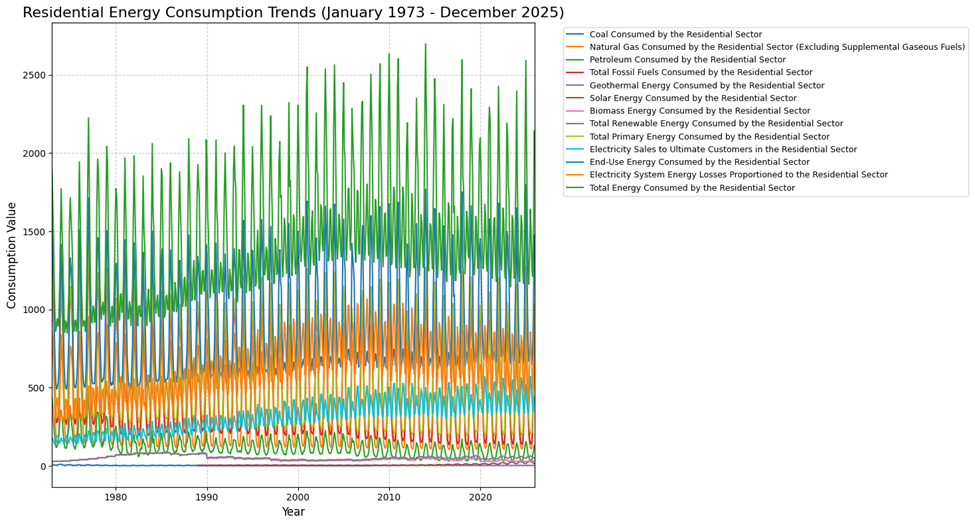
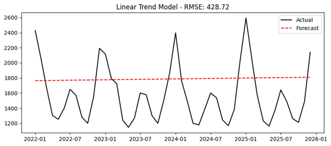
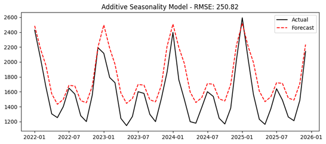
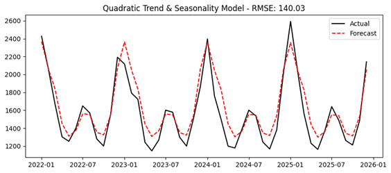
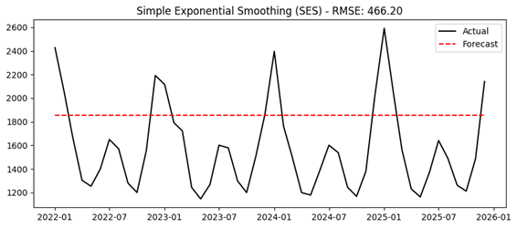
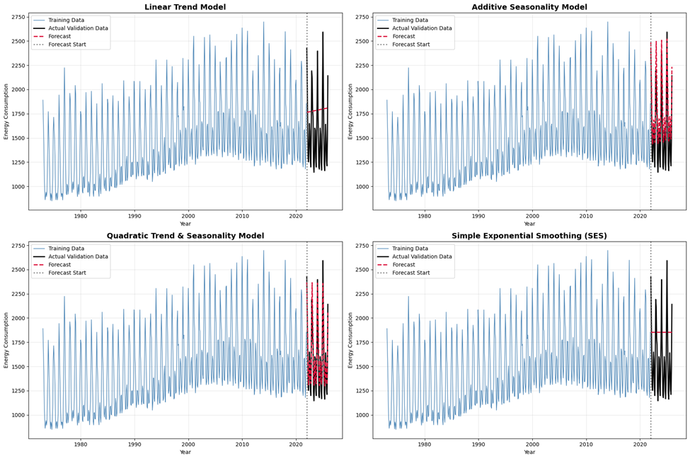
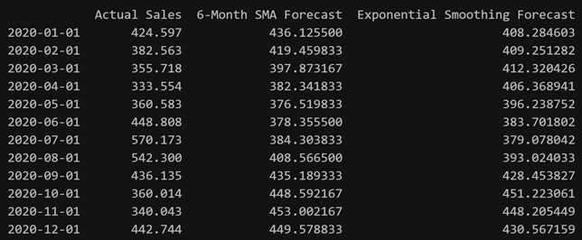
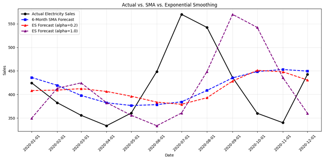
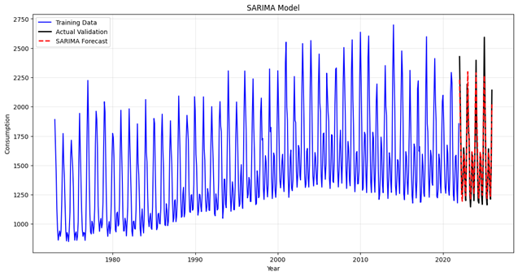
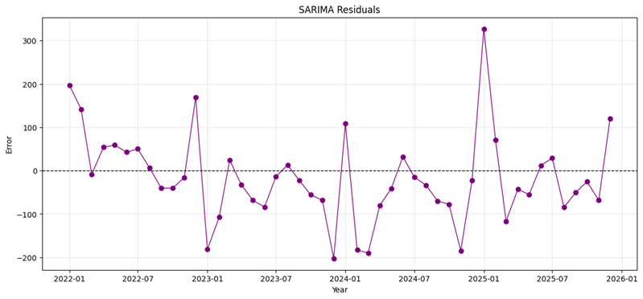

# EIA_Residential_Energy_Consumption_Time_Series_Forecasting
The dataset, titled 'Table_2.2_Residential_Sector_Energy_Consumption.xlsx' contains monthly electricity consumption data for the United States, specifically focusing on residential electricity usage. The dataset spans from January 1973 to December 2025, forming a continuous time series.

## Dataset Description
The dataset tracks monthly energy consumption for the residential sector over a long-term period.
### Data & Setup

#### Variables:
```
`Date`: Monthly timestamp (1973–2025)
`Electricity Sales`: Monthly residential electricity consumption values
```
#### Running the Project:
```
Google Colab: Set notebook_type = 'colab'
```
#### Local: Run the following in your terminal:
  ```bash
  python -m venv .venv
  .\.venv\Scripts\activate.ps1
  pip install -r requirements.txt
```

## Plot of the entire dataset covering January 1973 to December 2025
 

## Train and evaluate the following forecasting models:
Training Set Range: 1973-01-01 to 2021-12-01
Validation Set Range: 2022-01-01 to 2025-12-01

    - Linear-Trend
    - Additive + Seasonal
    - Quadratic-Trend + Seasonal
    - Simple-Exponential-Smoothing 
### Linear-Trend 
The linear trend model performed poorly with a R^2 score of -0.3464 which indicates the model is less accurate than a simple horizontal line representing the mean of the data. With a MAPE score of 26.6% and RMSE of 428.71, the model fails to account for significant seasonal fluctuations.

 

### Additive + Seasonal
In the additive seasonality model, there is a significant improvement with an R^2 score of 0.5392. The MAPE dropped to 15.5% and MAE decreased to 222.88. This model successfully captures the seasonal wave patterns of energy use but the remaining error suggests that a simple linear trend is not enough to describe the data long term.

 


### Quadratic-Trend + Seasonal 
The quadratic trend and seasonality model was the highest performing model across the 4. It achieved the lowest RMSE of 140.03 and a very low MAPE of 7.5% meaning the forecasting are on average within 7.5% of the actual values. The R^2 came in at 0.8564 which tells me that the model explains a large majority of the variance in the data. The combination of a quadratic trend and seasonal adjustments is the best way of the 4 to model this seasonal energy dataset. 

 

### Simple-Exponential-Smoothing
Simple exponential smoothing gave the worst performance of the 4 with the highest RMSE of 466.19 and a MAPE of 29.83%. The R^2 is deeply negative at -0.5921 which is expected as the model produces a flat lined forecast and ignores both long term trend and seasonal spikes. This is not the model to use for this type of seasonal energy data.

 

### Combined Plots view for each of the four models showing actual vs. forecasted values. 
 

### Alpha(smoothing) value used for the SES model. Explaination on how the optimal value was determined.
In SES, an alpha of 1 was used. Using the statsmodel package, I called the .fit() method which computes an optimal alpha by minimizing the SSE. Through the iteration process built into the method, it will eventually converge at an alpha with the minimal SSE. 
Given that the SES decided on an alpha of 1, it determined to give the most weight to recent data points over older data. The dataset shown has strong seasonality and trend components and with an alpha of 1, the forecast effectively is equal to the final observation of the training set since the algorithm determined that the most recent observation is the most accurate predictor for the immediate future in that SSE reduction process. This essentially turned the forecast into a naïve forecast. 

### Explaination for when exponential smoothing is preferred over a simple moving average. 
#### Table including:
    - Actual electricity sales values 
    - 6-month Simple Moving Average forecast 
    - Exponential Smoothing forecast (α = 0.2)

 

Exponential smoothing is generally preferred over simple moving averages for many reasons such as exponential smoothing’s ability to apply exponentially decaying weights to datapoints which gives importance to recent observations while SMA gives equal weight to all data points in a given window.
Exponential smoothing is also capable of reducing lag in trend changes.
Exponential smoothing is also more customizable by allowing us to tune the alpha to adjust for noisy data. Meanwhile SMA only allows window size changes. 

 

We can see that by tuning the alpha down from the value of 1 to 0.2, the fit of the model was much closer to SMA versus the alpha of 1 which shows a 2-month lag but fit closer to the actual data. 
In the 6-month SMA, each of the last 6 months is given a weight of about 16.6% on average and the ES model using an alpha of 0.2 gives a weight of about 20% so the responsiveness of both these models are very similar.

### SARIMA model parameter selection (p, d, q, P, D, Q, m) using ACF/PACF or AIC
    - start_p=1, # optimizer starts at 1 and optimizer will test values up to max_p and choose best p based on AIC
    - start_q=1, # initial order of the MA component; the optimizer will test values from here up to max_q
    - max_p=3, # reasonable range to stop overfitting
    - max_q=3, # reasonable range to stop overfitting
    - m=12, #set to 12 because the dataset is monthly and we expect yearly seasonality
    - start_P=0, # starting order for the seasonal auto regressive component
    - seasonal=True, # enable seasonal components to upgrade the model from ARIMA to SARIMA
    - d=None, # non seasonal differencing set to None to let the algorithm automatically determine the best value via unit root tests
    - D=1, # seasonal differencing set to 1 to remove the seasonal trend and make the series stationary
    - order = stepwise_model.order #(p,d,q)
    - seasonal_order = stepwise_model.seasonal_order #(P,D,Q,m)

#### SARIMA Performance Metrics
 

#### Final Model Performance
| MAE | RMSE | MAPE | R² |
| :---: | :---: | :---: | :---: |
| 77.9812 | 102.9079 | **4.7379%** | **0.9224** |

### Comparing SARIMA with Quadratic-Trend + Seasonal 
The SARIMA model performs better. Below is a chart comparing the two models. 

#### Model Comparison: Quadratic vs. SARIMA
| Metric | Quadratic | SARIMA | Winner | Improvement |
| :--- | :---: | :---: | :---: | :--- |
| **RMSE** | 140.03 | 102.91 | **SARIMA** | 26% lower error |
| **MAPE** | 7.5% | 4.74% | **SARIMA** | 37% more accurate |
| **R²** | 0.8564 | 0.9224 | **SARIMA** | 7% more variance explained |

While the Quadratic Trend and Seasonality model was the best of the initial baseline models, the SARIMA model is significantly more accurate. It reduced the MAPE from 7.5% to 4.74% and increased the R^2from 0.8564 to 0.9224. This improvement is due to SARIMA's ability to use both the historical trend and the most recent observed values to refine its predictions, whereas the Quadratic model relies solely on a fixed mathematical function of time. 

### Error Analysis & Model Anomalies explained by Impact of External Factors on Forecast Accuracy
 

#### Analysis of Largest Forecast Errors
| Date | Error Value | Prediction Status |
| :--- | :---: | :--- |
| 2025-01-01 | 327.0949 | Under-predicted |
| 2023-12-01 | -202.5280 | Over-predicted |

In a quick google search, January 2025 had extreme climate volatility featuring a very costly wildfire near LA and a historic blizzard with extreme snowfall in the Gulf Cost. Due to rare shock scenarios that were not previously represented in the data, extreme energy usages during this time were unable to be predicted accurately causing the under prediction of energy consumption. 
December of 2023 had record setting warmth with the warmest December in many states which would decrease the need for energy consumption on heating during that time. Therefore, the model would overpredict the amount of usage. 
